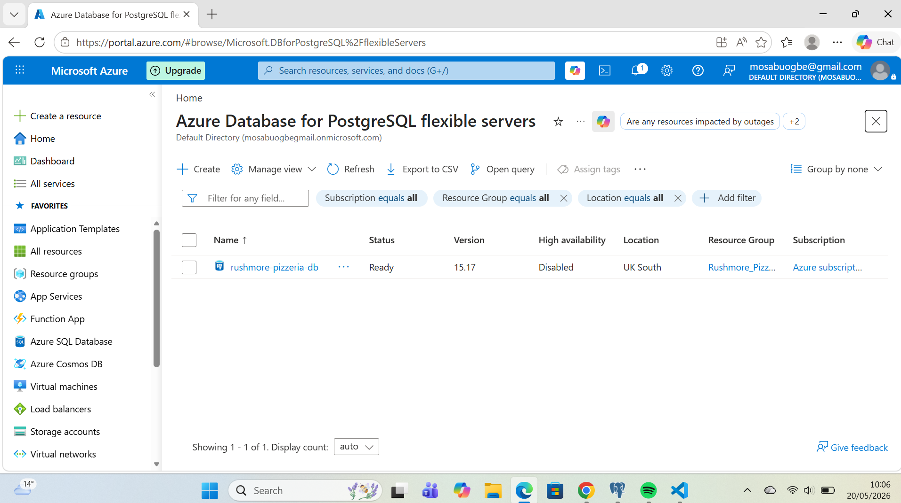
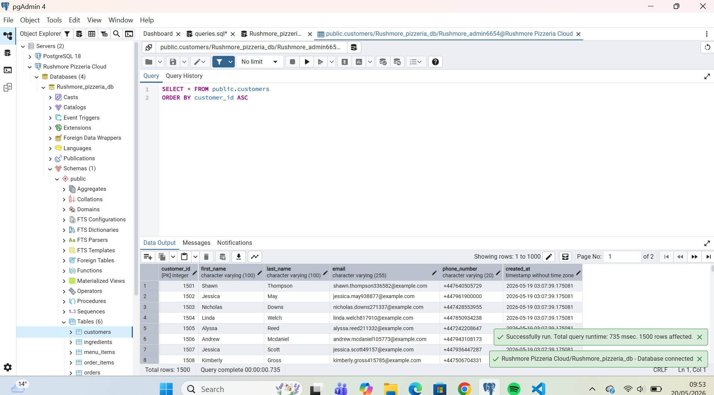
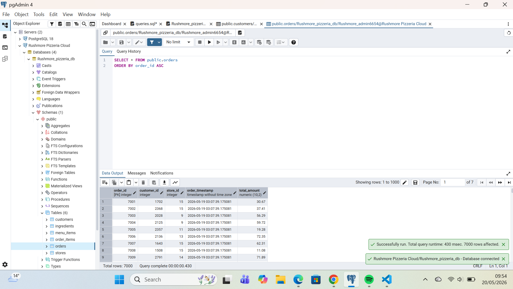
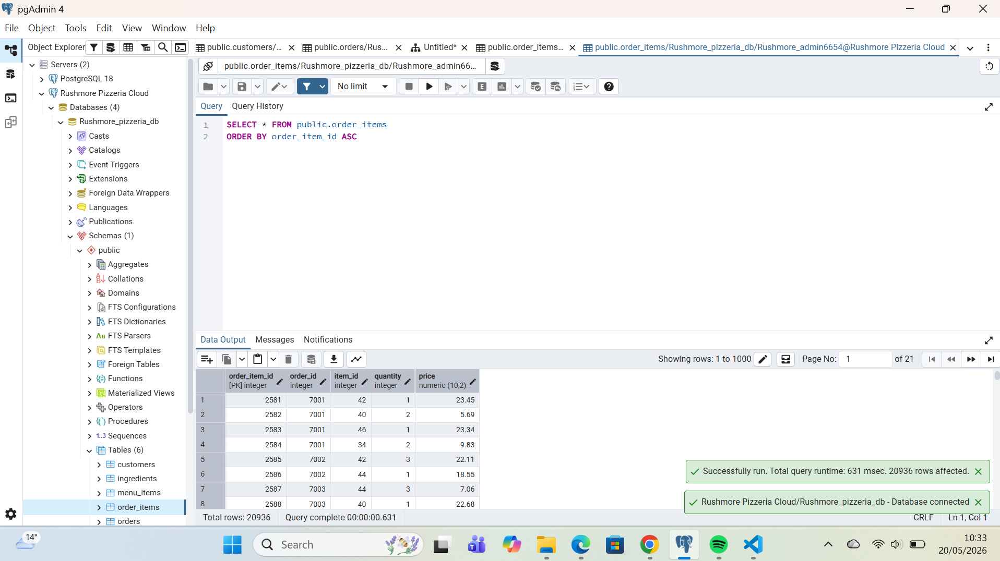
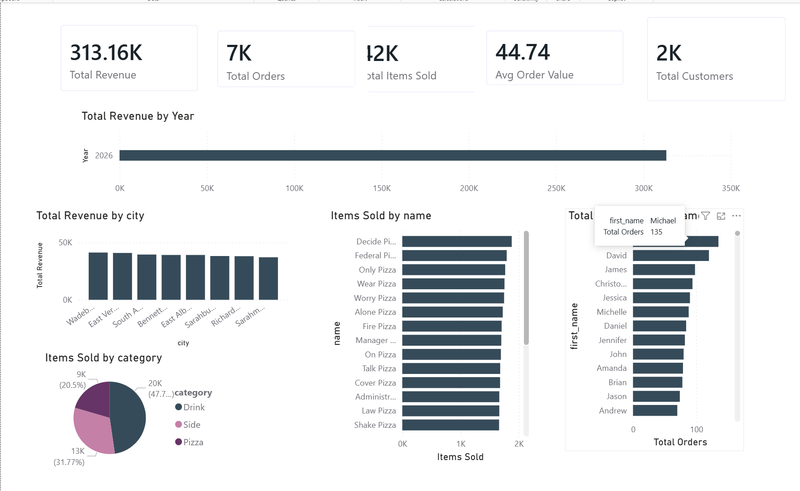

## Rushmore Pizzeria Cloud Database & Analytics Platform

An end-to-end cloud-based data engineering and business intelligence platform developed for Rushmore Pizzeria as a capstone project.

This solution modernizes a traditional localized file-based operational system into a scalable cloud-native analytics environment using PostgreSQL on Microsoft Azure, automated synthetic data generation pipelines in Python, and interactive executive dashboards in Power BI.

The project demonstrates practical implementation of:

Cloud database deployment
Relational database design
ETL pipeline engineering
Data modeling and normalization
SQL analytics
Business intelligence reporting
Real-time cloud-connected dashboards

## 📌 Project Objectives

The primary objective of this project was to design and implement a production-style cloud data platform capable of:

Managing operational restaurant data at scale
Enforcing relational data integrity
Supporting analytical business queries
Generating synthetic enterprise-scale transactional data
Delivering actionable business insights through interactive dashboards

## 🛠️ Technology Stack
Layer	Technologies
Database Engine	PostgreSQL 15
Cloud Platform	Microsoft Azure Database for PostgreSQL
ETL & Data Generation	Python 3.x
Python Libraries	psycopg2-binary, Faker
Database Administration	pgAdmin 4
Development Environment	Visual Studio Code
Business Intelligence	Power BI Desktop
Version Control	Git & GitHub

## ☁️ Cloud Architecture

The solution is deployed on a fully managed Azure PostgreSQL Flexible Server instance, enabling:

Cloud-hosted relational storage
Secure remote database access
High availability architecture
Scalable transactional workloads
Real-time BI integration

## 🧱 Database Design & Data Modeling

The database schema was designed using Third Normal Form (3NF) principles to minimize redundancy and maintain consistency across all operational entities.

Core Design Features
Primary Key constraints
Foreign Key relationships
Referential integrity enforcement
Cascading delete strategies
Normalized transactional structure
Scalable relational modeling

## 🗂️ Entity Relationship Structure
The platform contains six primary operational tables:

Table	Purpose
Stores	Branch and location management
Customers	Customer profile management
Ingredients	Inventory and stock tracking
Menu_Items	Product catalog and pricing
Orders	Transactional sales records
Order_Items	Line-item transactional breakdown

## 📐 Entity Relationship Diagram (ERD)

## ⚙️ ETL Pipeline Engineering

A custom Python-based ETL pipeline was developed to simulate enterprise transactional workloads.

## ETL Workflow
1️⃣ Extract

Synthetic operational data generated using the Faker library.

2️⃣ Transform

Data cleaning and transformation processes included:

Unique email generation
Phone number normalization
Data formatting
Constraint validation
Duplicate handling

3️⃣ Load

Processed datasets were loaded directly into the Azure PostgreSQL cloud database using psycopg2.

## 📊 Synthetic Dataset Scale

The cloud environment was stress-tested using large-scale generated transactional data. As shown on screenshots below:

## Production Dataset Metrics
Dataset	Volume
Stores	5
Ingredients	45
Menu Items	25
Customers	2,000+
Orders	7,000+
Order Items	20,000+

## 📈 SQL Analytics Layer

Analytical SQL queries were developed to answer key operational business questions, including:

Total revenue generation
Average order value
Customer purchase behavior
Product performance analysis
Store-level revenue comparison
Sales trend analysis

Example analytical queries are included in:

[queries.sql](queries.sql)

## 📊 Power BI Business Intelligence Dashboard

The Azure PostgreSQL database was connected directly to Power BI to create a real-time interactive analytics dashboard.

## Dashboard Features
KPI summary cards
Revenue trend analysis
Product category distribution
Store-level performance analysis
Customer segmentation
Interactive filtering and slicers

## 📉 Core Business Insights

The dashboard provides several executive-level analytical insights:

## Key Metrics
## KPI	        Value
Total Revenue	$313.16K
Average Order Value	$44.74
Total Orders	7K+
Total Customers	2K+
Total Items Sold	42K+

## 📊 Dashboard Preview

🚀 Key Skills Demonstrated

This project demonstrates practical competency in:

Cloud database deployment
Relational database administration
SQL development
Data modeling
ETL pipeline engineering
Python automation
Data analytics
Business intelligence visualization
Azure cloud services
Power BI reporting

## 📂 Project Structure
Rushmore-Pizzeria-Cloud-Database/
│
├── schema.sql
├── populate.py
├── queries.sql
├── README.md
│
├──images
    ├── Azure_Shot.png
    ├── ERD.png
    ├── PizzaDashboard.png
    ├── Server_Load1
    ├── Server_Load2
    ├── Server_Load3
│
└── .gitignore

## ▶️ Running the Project
1️⃣ Clone Repository
git clone https://github.com/Mirrz64/Rushmore-Pizzeria-Cloud-Database.git

2️⃣ Install Dependencies
pip install psycopg2-binary faker

3️⃣ Configure Database Connection

Update Azure PostgreSQL credentials inside:
.env

4️⃣ Run Schema

Execute: schema.sql

inside pgAdmin Query Tool.

5️⃣ Populate Database
python populate.py

6️⃣ Connect Power BI

Connect Power BI to the Azure PostgreSQL server and load the tables for visualization.

## 📌 Future Improvements

Potential future enhancements include:

Real-time streaming ingestion
Automated ETL scheduling
Azure Data Factory integration
Inventory forecasting models
Customer retention analytics
REST API integration
Docker containerization
CI/CD deployment workflows

## 👨‍💻 Author

Developed by Miracle Osabuogbe as a Cloud Data Engineering & Analytics Capstone Project demonstrating practical implementation of modern cloud-native database and business intelligence workflows.